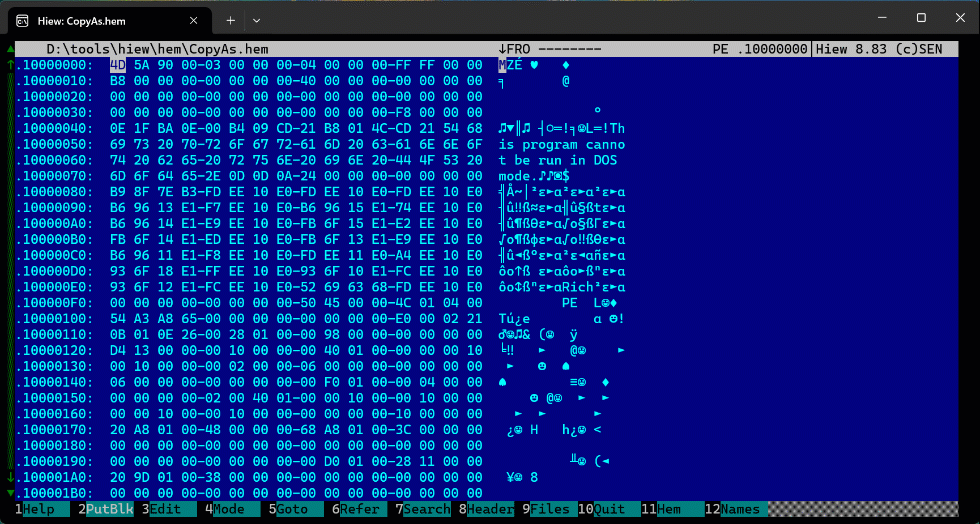

# Hashes

[Hiew](https://hiew.io) External Module (HEM) to calculate CRC-32, MD5, SHA-1, and
SHA-256 hashes of files and blocks.

## Installation

Extract the `.hem` file to Hiew's `hem` folder.

## Usage

After opening a file in Hiew, press `F11` to load a Hiew module and choose Hashes from the menu.
It will calculate common hashes of the whole file. For marked blocks, Hashes will generate
the hashes of the block content. Available commands:

- `F1` show help window.
- `F5` copy selected hash to clipboard.
- `F6` copy all hashes to clipboard.
- `ENTER` copy selected hash to clipboard and close Hashes window.

### Example

## Benchmarks

Hashes is fast. It calculates all four hash values it supports in the time it takes
other software to calculate one. The following is a comparison table with other
software hadhing a common 4 GB file. The hardware is also the same.

Program | Version | OS  | Hashes | Average time (seconds)
------- | ------- | --- | ------ | ----------------------
md5sum | 9.4 | Kali (WSL) | MD5 | 26
PowerShell Get-FileHash cmdlet | 5.1.26100.2161 | Windows 11 | MD5 | 9
010 Editor | 15.01 | Windows 11 | MD5 | 7
7-Zip | 24.09 | Windows 11 | MD5 | 7
md5sum | 9.4 | Ubuntu 24.04.1 | MD5 | 7
WinHex | 21.3 SR-6 | Windows 11 | MD5 | 6
010 Editor | 15.01 | Windows 11 | CRC-32, MD5, SHA-1, and SHA-256 | 52
010 Editor | 15.01 | Ubuntu 24.04.1 | CRC-32, MD5, SHA-1, and SHA-256 | 35
Hashes | 1.04 | Windows 11 | CRC-32, MD5, SHA-1, and SHA-256 | 16
7-Zip | 24.09 | Windows 11 | CRC-32, MD5, SHA-1, and SHA-256 | 12
Hashes | 2.00 | Windows 11 | CRC-32, MD5, SHA-1, and SHA-256 | 8

## Requirements

- Licensed version of Hiew.
- Windows Vista or newer.
- Visual C++ Redistributable for Visual Studio.

### Note for Windows XP users

It is possible to use Hashes with it, but you need the following:

- Visual C++ Redistributable for Visual Studio v16.7.
Download it from [here](https://my.visualstudio.com/downloads) (requires a Microsoft account).
- `bcrypt.dll` in Hiew's folder or any other folder listed in `%PATH%`.
There's an open source implementation [here](https://github.com/Blaukovitch/bcrypt-XP).

## Thanks

- @taviso for his [kiewtai module](https://github.com/taviso/kiewtai) (I borrowed
code from it, but inserted my own bugs :cowboy_hat_face:).
- SEN for Hiew.

## Author

Fernando Mercês - @mer0x36
